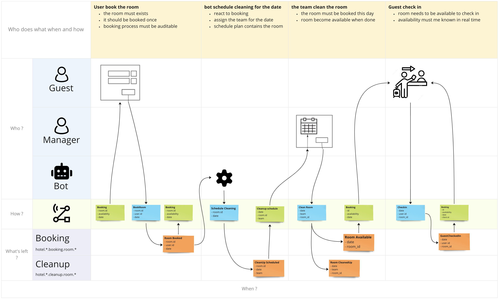
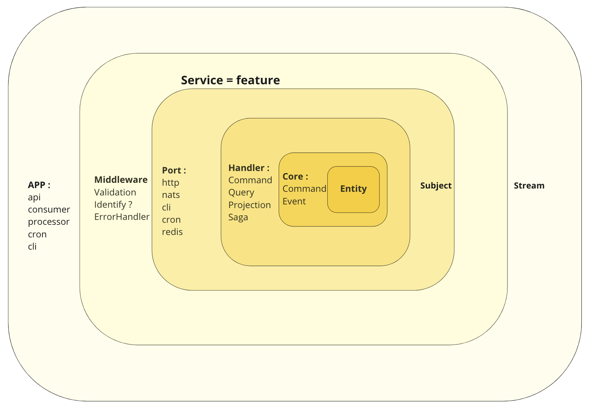

# Event modeling
Goal, Make this schema alive : 


Described using [Event Modeling](https://eventmodeling.org/)
All the post-its on the schema exists in the codebase

## Using NATS Jetstream and NestJS
- [Code : Full API of NATS JetStream in javascript(ish)](https://github.com/nats-io/nats.deno/blob/main/jetstream.md)
- [What are Event Collaboration And Event Sourcing ?](https://www.reactivesystems.eu/2022/06/09/event-collaboration-event-sourcing.html)
- [Anatomy of a NATS application](https://docs.nats.io/using-nats/developer/anatomy)
- [NestJS NATS JetStream microservice library](https://github.com/Vinceveve/nats-jetstream-transport)

# Concepts

And folder structure too

## Feature :

The whole schema :
One folder per event model containing everything needed for the flow

### Adapter

Rows on the top :
For each UI/Trigger on the schema an adapter.

NestJS controllers to adapt source protocol to domain's needs

- HTTP REST API
- Nats consumers :
  - [A consumer is a stateful view of a stream](https://docs.nats.io/nats-concepts/jetstream/consumers)

  - trigger side effects (think saga)
  - keep read models up to date
  - dedicated consumer to limit blast radius if any destination has an issue


### Command

Blue post-its :

- Business logic : handles command, emits events.
- WARNING : Create, Update, Delete on the database is forbidden here !
- Better to use with one Command by file to make code more atomic.
- Consistency on the application :
  [Infinite message deduplication in JetStream](https://nats.io/blog/new-per-subject-discard-policy)
- Publish domain events on nats [subjects](https://docs.nats.io/nats-concepts/subjects) (JetStream or Core)

### Projection

Green Post it :

- Consume events to manage read model's state
- Build needed read model(s) for this feature.
- Can be used for versionning and event.specversion management.
- [Build a materialised view with an history using nats keystore](https://docs.nats.io/using-nats/developer/develop_jetstream/kv)

## Model
All DTOs are here :
- Shared accross all features on all domains and all teams
- One folder per domain (bottom rows on the schema)
- Mainly declarative

### Event

Orange Post its

- An event describe a finished action.
- A Domain Event describes an interesting action that occurred in the past and has an impact within the domain.
- Convention used : [CloudEvents, a specification for describing event data in a common way](https://cloudevents.io)

### Stream

The row on the bottom :

- Where the events are gonna be stored or will be consumed.
- Conservation, deduplication, rate limit, ordering, ... are configured here
- [Definition of a stream](https://docs.nats.io/nats-concepts/jetstream/streams)
- [Multi Tenancy using Accounts](https://docs.nats.io/running-a-nats-service/configuration/securing_nats/accounts)

### Entity

Our core domain

- A data model with an ID.
- Used to derivate other DTO : event, command, query results, ...
- Centralise validation rules using class validator with [JSON Schema](https://github.com/epiphone/class-validator-jsonschema) or [AsyncAPI schema](https://www.npmjs.com/package/nestjs-asyncapi) 
- [Modelina is the official AsyncAPI SDK to generate data models](https://www.npmjs.com/package/@asyncapi/modelina)




## Run it
```bash
docker run -d --name nats -p 4222:4222 -p 8222:8222 -p 6222:6222 nats --jetstream -m 8222

rush install
ts-node feature/hotel-booking/backend/main.ts 

curl --request PUT \
 --url http://127.0.0.1:3000/mutation/book-room \
 --header 'Content-Type: application/json' \
 --data '{
    "data": {
      "room": { "id" : 1},
      "client": { "id": 1},
      "date": "2022-12-12"
    }
  }'

curl --request PUT \
 --url http://127.0.0.1:3000/mutation/cleanup \
 --header 'Content-Type: application/json' \
 --data '{
    "data": {
      "room": { "id" : 1},
      "date": "2022-12-12"
    }
  }'

curl --request PUT \
 --url http://127.0.0.1:3000/mutation/checkin \
 --header 'Content-Type: application/json' \
 --data '{
    "data": {
      "room": { "id" : 1 },
      "client": { "id": 1},
      "date": "2022-12-13"
    }
  }'

nats stream view room-booking --subject='booking.1.2022-12-12.1_2022-12-12'
nats stream view room-cleanup --subject='cleanup.1.2022-12-12.1_2022-12-12'
```


## TODO :

- [x] Documentation
  - [ ] AsyncAPI request and sub
  - [ ] Websocket example
  - [ ] NATS cli command doc to debug (or docker GUI ?)
- [x] Event|Command validation
  - [x] Use CloudEvent as base event interface on driver
  - [x] Use CloudEvent as base command interface
  - [ ] Middleware validation 
- [x] Idempotency
  - [x] publish options per event's emit
  - [ ] Fix Expect last subject sequence not working (poc root)
- [x] Shared state with materialized views
  - [x] allow access to nats JetStream KeyStore from client
  - [x] mapper to nats Keystore table.id.attributes = bucket.key.value
  - [x] watch in projection to compare with state
  - [x] handle state modification automatically
- [ ] QOS connection lost
  - [ ] Implement heartbeat https://github.com/nats-io/nats.deno/blob/main/jetstream.md#heartbeats
  - [x] Audit log stream with 14 days memory, store command = event type, date, subject, id
  - [x] Correlation ID shared from start of process
- [ ] Auth and security
  - [ ] configure nats accounts
  - [ ] Set websocket access limits solutions
- [x] Publishing
  - [x] publish event
  - [ ] send message
  - [x] simplify NatsJetStreamClient+Proxy
- [x] Subscribing
  - [ ] Pull Subscription 
  - [x] One specific consumer per destination
  - [x] consumer
  - [ ] message handler with nats
  - [x] auto stream creation
